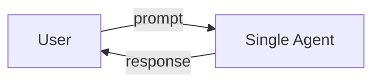
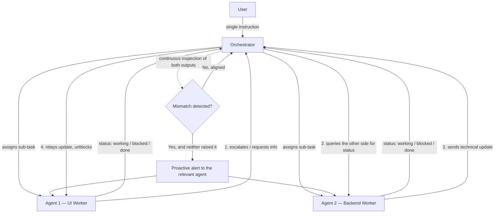
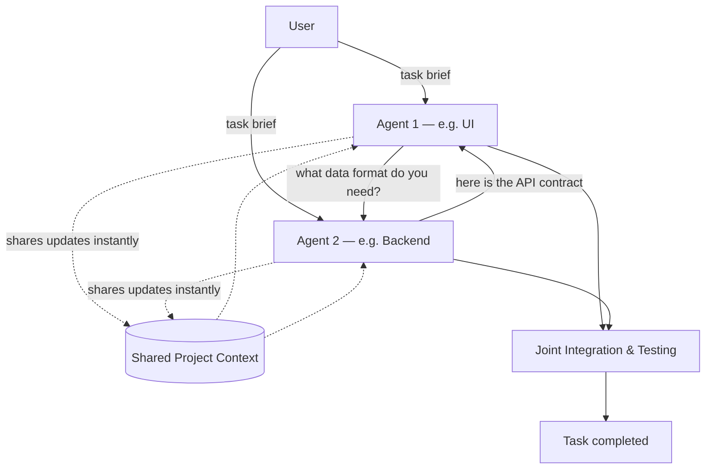
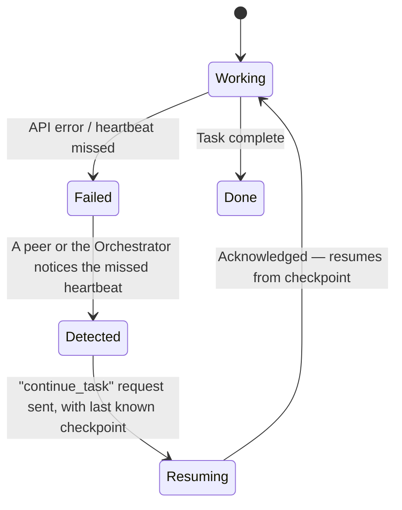

# Multi-Agent AI System — Architecture Blueprint

**Three operating modes, one platform: Simple, Agentic, and Cooperative — with a built-in self-healing protocol for API failures.**

---

## 1. Context & Goals

The system is a chat-driven AI coding/task assistant, similar in spirit to tools like OpenCode or Codex, but with three selectable operating modes depending on how much autonomy and parallelism the task needs.

**Functional goals**
- Let the user pick a mode per task (or per project): a single assistant, a coordinated team with a lead, or two peers working side by side.
- In multi-agent modes, the user should not have to manually route information between agents — the agents route it themselves.
- The system must survive the thing that breaks it most often in practice: **mid-task API failures** (dropped connections, timeouts, rate limits). Recovery should be automatic, not something the user has to trigger by typing "continue."

**Non-functional goals**
- Failure detection and recovery should add seconds, not minutes, to a stalled task.
- Recovery logic should not create infinite retry storms that burn API credits silently.
- The UI should make it obvious, at a glance, what each agent is doing right now.

---

## 2. The Three Modes — Quick Reference

| Mode | Agents | Coordination model | Best for | Who revives whom on failure |
|---|---|---|---|---|
| **Simple** | 1 | None — direct chat | General-purpose assistant use, quick single-purpose tasks | User retries manually (same as any chat tool today) |
| **Agentic** | 1 Orchestrator + 2 Workers | Centralized — Orchestrator assigns, monitors, and mediates | Larger tasks with distinct sub-domains (e.g. UI vs. Backend) that need someone keeping them aligned | Whichever of the three is still alive revives the other(s) |
| **Cooperative** | 2 Peers | Decentralized — peers share context and sync directly | Two tightly-coupled workstreams where a coordinator would just be overhead | The surviving peer revives the other directly |

---

## 3. Mode 1 — Simple

This is the baseline: one agent, one conversation, no orchestration layer. It exists so the platform is still a normal, competent chat assistant when a task doesn't need a team.



Nothing about task decomposition, mismatch detection, or multi-party recovery applies here — if the API call fails, it fails the same way it does in any single-agent chat tool today, and the user retries. This mode is the fallback and the control group for measuring whether the other two modes are actually worth their added complexity.

---

## 4. Mode 2 — Agentic (Head + Workers)

### 4.1 Roles

- **Orchestrator ("Head")** — the only agent the user talks to directly. It receives the instruction, breaks it into sub-tasks, assigns them to the workers, and continuously watches both workers' outputs for conflicts.
- **Worker Agents** (e.g. Agent 1 = UI, Agent 2 = Backend) — each works its own slice of the task inside its own workspace. They don't need to be told to report in; they surface status changes on their own, and the user can watch them work without commanding them turn by turn.

### 4.2 Flow



Two things are doing the real work here:

1. **Assignment without micromanagement.** The user gives the Orchestrator one instruction; the Orchestrator decides the split and hands each worker its slice. The user never has to manually message Agent 1 or Agent 2 — the UI just shows their panes updating live.
2. **Continuous inspection, not just relay.** The Orchestrator isn't a passive router. It's always diffing the two workers' outputs against each other. If it spots a contract mismatch (say, the UI expects a field the backend doesn't return) *before either worker has noticed or said anything*, it proactively alerts whichever one needs to change — this is the difference between a coordinator and a mailbox.
3. **The escalation path is bidirectional.** Either worker can initiate the "I'm blocked, what's the status on your side" request; the Orchestrator queries the other worker and relays the answer back. Nothing here is worker-1-privileged.

### 4.3 UI representation

- One chat pane where the user talks only to the Orchestrator.
- Two (or N) read-only live panes below/beside it, one per worker, streaming their current action and status (`working` / `blocked` / `done`).
- A small alert indicator on a worker's pane when the Orchestrator has just sent it a mismatch notice — this is the one thing the user should be able to see happened without reading full logs.

### 4.4 Extensibility note

Nothing about this design is hard-coded to exactly two workers. Two is the concrete example (UI + Backend), but the Orchestrator's job — decompose, assign, inspect, mediate — scales to N workers as long as the inspection step scales (an O(N²) pairwise diff gets expensive past a handful of workers; past ~4–5 you'd want the Orchestrator diffing against a shared contract/spec rather than every worker against every other worker).

---

## 5. Mode 3 — Cooperative (Peer-to-Peer)

### 5.1 Roles

- **Two Peer Agents**, no head. Each owns a piece of the same project (e.g. Agent 1 = UI component, Agent 2 = API endpoint) and both have visibility into a shared project context, so neither is working blind to what the other is doing.

### 5.2 Flow



The key structural difference from Agentic mode: there's no third party mediating. Direct syncs ("what data format do you need?" / "here's the API contract") happen agent-to-agent, and every update either agent makes is pushed into a **shared project context** both of them read from — so at any point either agent can answer "what is the other one doing right now" without asking. The task ends in a joint integration/testing step both peers participate in, rather than a single hand-off.

### 5.3 UI representation

- Two peer panes, side by side, no separate chat lead — the user can address either pane directly.
- A shared context panel showing the live state both agents are reading from (current contracts, decisions, open questions).

### 5.4 Extensibility note

Cooperative mode is defined around two closely-coupled peers. Going beyond two starts to reintroduce the coordination problem Agentic mode already solves — at that point it's usually simpler to add a light Orchestrator than to build N-way peer sync.

---

## 6. Self-Healing Protocol — Surviving API Failures

This is the part that makes either multi-agent mode usable in practice. Because everything runs on LLM API calls, mid-task disconnects, timeouts, and rate-limit failures are the *normal* failure mode, not an edge case. The old fix was a human typing "continue the task." The design goal here is: **whoever is still alive sends the continuation request — automatically.**

### 6.1 Common mechanism

Every agent (Orchestrator and Workers/Peers alike) emits a periodic **heartbeat**. Any party that stops receiving another party's heartbeat for longer than a timeout window treats that party as failed and is responsible for reviving it by re-sending its last task with a "continue" instruction.



### 6.2 Agentic mode — who revives whom

| Failure | Detected by | Recovery request sent by → to | Outcome |
|---|---|---|---|
| Agent 1 or Agent 2 fails | Orchestrator (missed heartbeat from that worker) | Orchestrator → the failed worker | Worker resumes |
| Orchestrator fails | Agent 1 **and** Agent 2 (both miss heartbeat from Head) | Both workers → Orchestrator | Orchestrator resumes |
| Orchestrator **and** one worker fail simultaneously | The one worker still running (it notices both are silent) | Surviving worker → Orchestrator **and** → the failed worker | All three back online |

### 6.3 Cooperative mode — who revives whom

| Failure | Detected by | Recovery request sent by → to | Outcome |
|---|---|---|---|
| Agent 1 fails | Agent 2 (API disconnect/timeout) | Agent 2 → Agent 1 | Cooperation restored |
| Agent 2 fails | Agent 1 (API disconnect/timeout) | Agent 1 → Agent 2 | Cooperation restored |

### 6.4 The "continue_task" contract

The message that does the reviving needs to carry enough state that the resumed agent picks up where it left off rather than restarting blind:

```json
{
  "type": "continue_task",
  "from": "orchestrator",
  "to": "agent_ui",
  "reason": "heartbeat_timeout",
  "task_id": "b7e3...",
  "last_known_checkpoint": "PR draft saved, waiting on backend contract",
  "retry_count": 1,
  "timestamp": "2026-09-21T10:42:00Z"
}
```

### 6.5 One gap worth closing before you build this

None of the source diagrams specify a ceiling on retries. Worth deciding now, not after the first incident: cap `retry_count` (e.g. 3 attempts with backoff), and once it's exceeded, stop looping silently and surface a "this task needs a human" notice to the user instead of continuing to hammer a possibly-dead API key. Same logic applies to a scenario the diagrams don't cover — **all** parties failing at once (e.g. the API key itself is revoked) — where there's nobody left alive to send a continue request; that case needs an external watchdog (outside the agent processes) rather than peer-to-peer recovery.

---

## 7. Core System Components (Engineering View)

| Component | Responsibility |
|---|---|
| **Orchestrator Service** | (Agentic mode only) Task decomposition, assignment, continuous output inspection, mismatch mediation |
| **Agent Runtime** | Executes one agent's loop: receive task → call LLM API → act → report status → heartbeat |
| **Heartbeat Monitor** | Tracks last-seen timestamp per agent; fires a `failed` event after N missed intervals |
| **Message Bus** | Delivers `task_assignment`, `status_update`, `mismatch_alert`, `continue_task`, and `heartbeat` messages between agents |
| **Shared State Store** | Holds task state, per-agent status, and (Cooperative mode) the shared project context both peers read/write |
| **LLM API Gateway** | Wraps the actual provider calls; owns retry/backoff and is where a failed call first becomes visible as an event other agents can react to |
| **UI Layer** | Renders the single chat pane (Simple/Agentic) or dual peer panes (Cooperative), plus live status panes and alert indicators |

### 7.1 Agent state machine

```
Idle → Assigned → Working ⇄ Blocked → Failed → Resuming → Working → Done
```

`Blocked` is a normal, expected state (e.g. Agent 1 waiting on Agent 2's contract) and should be visually distinct from `Failed` in the UI — a blocked agent is fine and doesn't need reviving, a failed one does.

---

## 8. Key Design Decisions & Trade-offs

- **Fixed 2 workers vs. N workers (Agentic mode):** two keeps the mismatch-inspection step cheap (one pair to diff) and matches the concrete UI/Backend use case. Generalizing to N is straightforward for assignment but the inspection step needs to move from pairwise diffing to contract-based checking as N grows (see §4.4).
- **Centralized (Agentic) vs. decentralized (Cooperative) recovery:** Agentic mode's Orchestrator is a single point of coordination *and* a single point of failure — which is exactly why the design has the workers revive the Orchestrator, not just the reverse. Cooperative mode has no such single point, so recovery is symmetric.
- **Heartbeat interval:** too short wastes API calls/compute on liveness checks; too long delays failure detection. This needs to be tuned against your actual task latency, not fixed in this spec.
- **Retry ceiling:** see §6.5 — silent infinite retries are worse than no self-healing at all if the underlying API key is actually dead.

---

## 9. Suggested Build Order

1. **Simple mode** — ship the baseline single-agent chat loop first; it's the fallback for every other mode and validates the core LLM-API-gateway/retry plumbing.
2. **Agentic mode, no self-healing yet** — Orchestrator + 2 fixed workers, task assignment and status reporting working end to end.
3. **Add continuous inspection & mismatch mediation** to Agentic mode.
4. **Cooperative mode** — 2 peers, direct sync, shared context store, joint integration step.
5. **Self-healing protocol** — heartbeat monitor + `continue_task` contract, layered onto both modes 2 and 4. Build the retry ceiling and human-escalation path at the same time, not after.

---

## 10. Open Questions to Resolve Before Building

- When the Orchestrator's mismatch check flags a conflict where *both* workers are technically "correct" (e.g. two valid but incompatible API shapes), who has final say?
- Should `continue_task` requests be authenticated/signed so a compromised agent can't spoof recovery messages to another agent?
- What's the actual heartbeat interval and missed-beat threshold for your target task latency (seconds vs. minutes matters a lot here)?
- Does the UI need a manual "override and command a specific worker directly" escape hatch for Agentic mode, or is Orchestrator-only control a hard rule?
